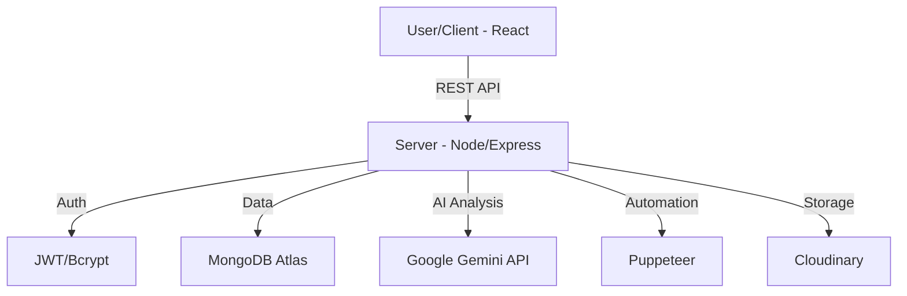

# 🚀 AutoApply AI: AI-Powered Job Application Automation

[](https://www.mongodb.com/mern-stack)
[](https://ai.google.dev/)
[](https://opensource.org/licenses/MIT)
[]()

AutoApply AI is a high-performance, full-stack automation platform designed to revolutionize the job search experience. By leveraging the power of **Google Gemini AI** and **Puppeteer**, the platform automates the tedious parts of job hunting—from resume optimization to automated application workflows—allowing candidates to focus on what matters most: the interview.

---

## 📑 Table of Contents
1. [Introduction](#-introduction--problem-statement)
2. [Why This Project Matters](#-why-this-project-matters)
3. [Objectives](#-objectives)
4. [Features](#-core-features)
5. [Tech Stack](#-tech-stack)
6. [System Architecture](#-system-architecture-overview)
7. [Folder Structure](#-folder-structure)
8. [Roadmap](#-development-roadmap)
9. [Installation & Setup](#-installation--setup-instructions)
10. [Deployment](#-deployment-plan)
11. [Author](#-author)

---

## 💡 Introduction / Problem Statement
Applying for jobs in today’s market is a numbers game. Candidates often spend hours manually searching for roles, tailoring resumes, and writing cover letters, only to receive generic rejections. 

**The Problem:**
- **Time Inefficiency:** Spending 30+ minutes per application.
- **Generic Resumes:** Lack of keyword optimization for ATS (Applicant Tracking Systems).
- **Application Fatigue:** Burnout from repetitive manual data entry.

---

## ✨ Why This Project Matters
For students and early-career professionals, the job market is increasingly competitive. **AutoApply AI** levels the playing field by providing enterprise-grade automation tools for free. It doesn't just apply for you; it ensures you are applying with the **best possible version of your profile**, optimized by AI to pass through ATS filters and catch the eye of recruiters.

---

## 🎯 Objectives
- **Centralize Job Tracking:** A single dashboard to manage all applications across different platforms.
- **Intelligent Optimization:** Use Generative AI to tailor resumes and cover letters in seconds.
- **Automated Workflows:** Reduce manual data entry using web automation scripts.
- **Data-Driven Insights:** Provide analytics on application success rates and feedback.

---

## 🛠️ Core Features
- **AI Resume Analyzer:** Scans your resume against job descriptions and provides a "Match Score."
- **AI Cover Letter Generator:** Crafts personalized, high-impact cover letters using Google Gemini.
- **Automation Engine:** Automated form filling and application submission via Puppeteer.
- **Real-time Dashboard:** Track status (Applied, Interviewing, Offered, Rejected) with visual charts.
- **Cloud Document Storage:** Securely store resumes and cover letters using Cloudinary.

### 📦 MVP Features (Phase 1)
- User Authentication (JWT).
- Dashboard for manual job entry and tracking.
- AI-generated Cover Letters based on PDF resumes.
- Basic Resume Score Analysis.

### 🚀 Future Scope
- **Chrome Extension:** One-click application directly from LinkedIn/Indeed.
- **Email Automation:** Automated follow-up emails to recruiters.
- **Multi-lingual Support:** AI optimization for international job markets.
- **Mock Interview Bot:** AI-powered voice/text interview preparation based on the job role.

---

## 💻 Tech Stack

### Frontend
- **React & Vite:** Ultra-fast development and optimized production builds.
- **Tailwind CSS:** Modern, utility-first styling for a premium UI.
- **React Router:** Declarative routing for a seamless SPA experience.
- **Axios:** Efficient API communication.

### Backend
- **Node.js & Express.js:** Scalable server-side logic and RESTful API architecture.
- **MongoDB Atlas:** Scalable NoSQL cloud database.
- **JWT & bcryptjs:** Secure authentication and password hashing.

### Integrations
- **AI:** Google Gemini API (Natural Language Processing).
- **Automation:** Puppeteer (Headless Browser Automation).
- **File Management:** Multer & Cloudinary (Secure image/PDF uploads).

---

## 🏗️ System Architecture Overview


---

## 📂 Folder Structure
```text
AutoApply-AI/
├── client/                # Frontend (React + Vite)
│   ├── src/
│   │   ├── components/    # Reusable UI (Buttons, Cards, Modals)
│   │   ├── pages/         # Dashboard, Login, ResumeView
│   │   ├── context/       # Auth and Global State
│   │   ├── api/           # Axios configurations
│   │   └── assets/        # Styles and Images
│   └── tailwind.config.js
├── server/                # Backend (Node + Express)
│   ├── config/            # DB, Cloudinary & AI Config
│   ├── controllers/       # Route Logic (authController, jobController)
│   ├── models/            # Mongoose Schemas (User, Job, Resume)
│   ├── routes/            # API Endpoints
│   ├── middleware/        # JWT Auth & Multer Setup
│   ├── utils/             # Gemini AI & Puppeteer Scripts
│   └── index.js           # Server Entry Point
├── .env                   # Environment Variables (Git ignored)
└── package.json           # Dependencies & Scripts
```

---

## 🗺️ Development Roadmap
- [x] **Phase 1:** Project setup, Database schema, and Authentication.
- [ ] **Phase 2:** AI integration for Resume Analysis and Cover Letters.
- [ ] **Phase 3:** Puppeteer automation scripts for job sites.
- [ ] **Phase 4:** Dashboard UI/UX optimization and Analytics.
- [ ] **Phase 5:** Final Testing, Bug fixes, and Deployment.

---

## ⚙️ Installation & Setup Instructions

### Prerequisites
- Node.js (v16 or higher)
- MongoDB Atlas Account
- Google Gemini API Key
- Cloudinary Account

### 1. Clone the Repository
```bash
git clone https://github.com/your-username/autoapply-ai.git
cd autoapply-ai
```

### 2. Backend Setup
```bash
cd server
npm install
```
Create a `.env` file in the `server` directory and add the following:
```env
PORT=5000
MONGO_URI=your_mongodb_atlas_uri
JWT_SECRET=your_jwt_secret
GEMINI_API_KEY=your_google_gemini_api_key
CLOUDINARY_CLOUD_NAME=your_cloud_name
CLOUDINARY_API_KEY=your_api_key
CLOUDINARY_API_SECRET=your_api_secret
```

### 3. Frontend Setup
```bash
cd ../client
npm install
```
Create a `.env` file in the `client` directory:
```env
VITE_API_URL=http://localhost:5000/api
```

### 4. Run the Application
- **Server:** `npm run dev` (inside /server)
- **Client:** `npm run dev` (inside /client)

---

## 🚢 Deployment Plan
- **Frontend:** Hosted on **Vercel** for high availability and global edge delivery.
- **Backend:** Hosted on **Render** (Web Service) with managed environment variables.
- **Database:** **MongoDB Atlas** (Cloud-native database).

---

## 🎓 Learning Outcomes
- Deep understanding of **MERN stack** integration.
- Implementing **Generative AI** in real-world SaaS applications.
- Mastering **Web Automation** with Puppeteer to handle dynamic content.
- Managing **Cloud Storage** and secure file handling for sensitive documents.
- Best practices in **JWT-based authentication** and API security.

---

## ✍️ Author
**Your Name**  
- GitHub: [@yourgithub](https://github.com/yourgithub)  
- LinkedIn: [Your Profile](https://linkedin.com/in/yourprofile)  
- Portfolio: [yourportfolio.com](https://yourportfolio.com)

---
*Developed with ❤️ for the community.*
"# JOB" 
